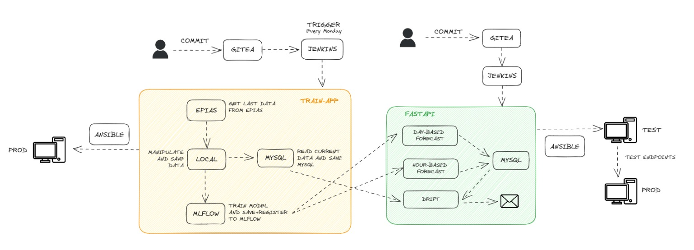

# Energy Consumption Forecast App

This is the final step/project of my journey through MLOps bootcamp, where I've had the opportunity to apply cutting-edge technologies like FastAPI, MLflow, Jenkins, Terraform etc and tap into real-time data from EPIAS. This project has been a labor of love, and it's designed to provide an end-to-end solution for monitoring and analyzing energy consumption data, sourced directly from EPIAS's Real Time Consumption data.

## Architecture

## Installation
